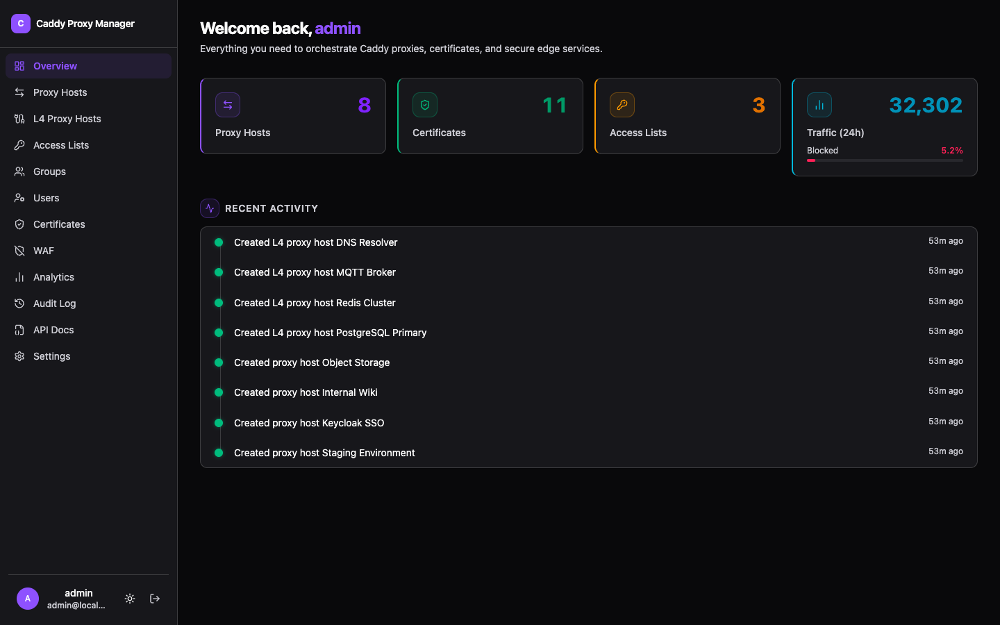

# Caddy Proxy Manager

Web interface for managing [Caddy Server](https://caddyserver.com/) reverse proxies and certificates.

[](https://mit-license.org)
[](https://nextjs.org/)
[](https://www.docker.com/)

[Report Bug](https://github.com/fuomag9/caddy-proxy-manager/issues) • [Request Feature](https://github.com/fuomag9/caddy-proxy-manager/issues)



## Overview

This project provides a web UI for Caddy Server, eliminating the need to manually edit JSON configurations or Caddyfiles. It handles reverse proxies, access lists, and certificate management through a shadcn/ui interface. Built with Next.js 16, React 19, shadcn/ui, Tailwind CSS, Drizzle ORM, and TypeScript. Analytics data (traffic events, WAF events) is stored in ClickHouse for fast aggregation queries, with automatic 90-day retention via TTL.

---

## Installation

```bash
git clone https://github.com/fuomag9/caddy-proxy-manager.git
cd caddy-proxy-manager
cp .env.example .env
# Edit .env with your credentials
docker compose up -d
```

Access at `http://localhost:3000/login`

Data persists in Docker volumes (caddy-manager-data, caddy-data, caddy-config, caddy-logs).

---

## Features

- **Proxy Hosts** - Reverse proxies with custom headers, multiple upstreams, load balancing (8 policies), active/passive health checks, retries, and enable/disable toggle
- **L4 Proxy Hosts** - TCP/UDP stream proxying with TLS SNI matching, proxy protocol (v1/v2), load balancing, health checks, and per-host geo blocking. Automatic Docker Compose port management via sidecar
- **Location Rules** - Path-based routing to different upstreams per proxy host (e.g. `/api/*` to one backend, `/ws/*` to another)
- **Redirect & Rewrite** - Per-host redirect rules (301/302/307/308) and path prefix rewriting
- **Forward Auth Portal** - Built-in identity provider for protecting proxy hosts without an external IdP. Credential and OAuth login portal, user groups with membership management, per-host access control by user or group, and excluded paths that bypass authentication
- **WAF** - Web Application Firewall powered by Coraza with optional OWASP Core Rule Set (SQLi, XSS, LFI, RCE). Per-host enable/disable, global and per-host rule suppression, custom SecLang directives, and a searchable event log with severity and blocked/detected classification
- **Analytics** - Live traffic charts, protocol breakdown, country map, top user agents, and blocked request log with configurable time ranges
- **Geo Blocking** - Block or allow traffic by country, continent, ASN, CIDR range, or exact IP per proxy host. Allow rules override block rules. Fail-closed mode, custom response codes/bodies, and trusted proxy support
- **Access Lists** - Multi-account HTTP basic auth protection (bcrypt-hashed) assignable per proxy host
- **Certificates** - Automatic HTTPS for every proxy host via Caddy ACME (Let's Encrypt / ZeroSSL), manual SSL/TLS import with expiry monitoring, and a built-in CA for issuing and revoking internal client certificates (mTLS)
- **mTLS** - Mutual TLS per proxy host using built-in CA certificates. Issue, track, and revoke client certificates. Fail-closed revocation (all certs revoked = all connections rejected)
- **mTLS RBAC** - Role-based access control for mTLS client certificates. Define roles, assign certs to roles, and create path-based access rules per proxy host (e.g. `/admin/*` requires the "ops" role)
- **User Roles** - Three-tier role system (Viewer, User, Admin) controlling dashboard access, API permissions, and feature visibility
- **User Management** - Admin page for managing users: edit roles, status, profiles; disable or delete accounts; search and filter
- **Groups** - Organize users into groups for forward auth access control. Assign groups to proxy hosts to grant access to all members at once
- **Authentik Integration** - Forward-auth SSO per proxy host with configurable header forwarding and protected paths
- **DNS Controls** - Custom DNS resolvers per host, upstream DNS pinning with IPv4/IPv6/both address family selection
- **REST API** - Full REST API under `/api/v1/` with Bearer token authentication, covering all resources. Interactive OpenAPI 3.1.0 docs at `/api-docs`
- **API Tokens** - Create and manage API tokens with optional expiration for programmatic access
- **Instance Sync** - Master/slave configuration sync for multi-instance deployments. The master pushes proxy hosts, certificates, access lists, and settings to slaves on every change
- **OAuth / SSO** - OAuth2/OIDC authentication with any compliant provider (Authentik, Keycloak, Auth0, etc.). Account linking from the Profile page
- **DNS Providers** - Multi-provider DNS-01 challenge support for ACME certificates: Cloudflare, Route 53, DigitalOcean, Duck DNS, Hetzner, Vultr, Porkbun, GoDaddy, Namecheap, OVH, IONOS, and Linode. Credentials encrypted at rest. Per-certificate provider override supported
- **Settings** - ACME email, DNS provider configuration, upstream DNS pinning defaults, Authentik outpost, Prometheus metrics, logging format
- **Audit Log** - Searchable configuration change history with user attribution and pagination
- **Search & Pagination** - Server-side search and pagination on all data tables
- **Dark Mode** - Full dark/light theme support with system preference detection
- **Mobile UI** - Fully responsive interface optimised for iPhone and other narrow viewports

---

## Configuration

### Environment Variables

| Variable | Description | Default | Required |
|----------|-------------|---------|----------|
| `SESSION_SECRET` | Session encryption key (32+ chars) | None | **Yes** |
| `ADMIN_USERNAME` | Admin login username | `admin` | **Yes** |
| `ADMIN_PASSWORD` | Admin password (see requirements below) | `admin` (dev only) | **Yes** |
| `BASE_URL` | Public URL where users access the dashboard.<br/>**Required for OAuth** - must match redirect URI | `http://localhost:3000` | **Yes** (if using OAuth) |
| `CADDY_API_URL` | Caddy Admin API endpoint | `http://caddy:2019` (prod)<br/>`http://localhost:2019` (dev) | No |
| `DATABASE_URL` | SQLite database URL | `file:/app/data/caddy-proxy-manager.db` | No |
| `CERTS_DIRECTORY` | Certificate storage directory | `./data/certs` | No |
| `LOGIN_MAX_ATTEMPTS` | Max login attempts before rate limit | `5` | No |
| `LOGIN_WINDOW_MS` | Rate limit window in milliseconds | `300000` (5 min) | No |
| `LOGIN_BLOCK_MS` | Rate limit block duration in milliseconds | `900000` (15 min) | No |
| `OAUTH_ENABLED` | Enable OAuth2/OIDC authentication | `false` | No |
| `OAUTH_PROVIDER_NAME` | Display name for OAuth provider | `OAuth2` | No |
| `OAUTH_CLIENT_ID` | OAuth2 client ID | None | No |
| `OAUTH_CLIENT_SECRET` | OAuth2 client secret | None | No |
| `OAUTH_ISSUER` | OAuth2 OIDC issuer URL | None | No |
| `OAUTH_AUTHORIZATION_URL` | Optional OAuth authorization endpoint override | Auto-discovered from `OAUTH_ISSUER` | No |
| `OAUTH_TOKEN_URL` | Optional OAuth token endpoint override | Auto-discovered from `OAUTH_ISSUER` | No |
| `OAUTH_USERINFO_URL` | Optional OAuth userinfo endpoint override | Auto-discovered from `OAUTH_ISSUER` | No |
| `OAUTH_ALLOW_AUTO_LINKING` | Allow auto-linking OAuth identities to existing users | `false` | No |
| `AUTH_TRUST_HOST` | Trust the Host header for URL construction (only behind proxies that rewrite Host) | `false` | No |
| `AUTH_RATE_LIMIT_ENABLED` | Enable Better Auth rate limiting | `true` | No |
| `AUTH_RATE_LIMIT_WINDOW` | Rate limit window in seconds | `60` | No |
| `AUTH_RATE_LIMIT_MAX` | Max requests per window | `5` | No |
| `INSTANCE_MODE` | Instance role: `standalone`, `master`, or `slave` | `standalone` | No |
| `INSTANCE_SYNC_TOKEN` | Bearer token slaves use to authenticate sync requests | None | No (required if `slave`) |
| `INSTANCE_SLAVES` | JSON array of slave instances for the master to push to | None | No |
| `INSTANCE_SYNC_INTERVAL` | Periodic sync interval in seconds (`0` = disabled) | `0` | No |
| `INSTANCE_SYNC_ALLOW_HTTP` | Allow sync over HTTP (for internal Docker networks) | `false` | No |
| `CLICKHOUSE_URL` | ClickHouse HTTP endpoint for analytics | `http://clickhouse:8123` | No |
| `CLICKHOUSE_USER` | ClickHouse username | `cpm` | No |
| `CLICKHOUSE_PASSWORD` | ClickHouse password (`openssl rand -base64 32`) | None | **Yes** |
| `CLICKHOUSE_DB` | ClickHouse database name | `analytics` | No |

**Production Requirements:**
- `SESSION_SECRET`: 32+ characters (`openssl rand -base64 32`)
- `ADMIN_PASSWORD`: 12+ chars with uppercase, lowercase, numbers, and special characters

Development mode (`NODE_ENV=development`) allows default `admin`/`admin` credentials.

---


## Security

- Production enforces strong passwords (12+ chars, mixed case, numbers, special characters)
- 32+ character session secrets required
- Login rate limiting: 5 attempts per 60 seconds
- Audit trail for all configuration changes
- Supports OAuth2/OIDC for SSO

**Production Setup:**
```bash
export SESSION_SECRET=$(openssl rand -base64 32)
export ADMIN_USERNAME="admin"
export ADMIN_PASSWORD="YourStr0ng-P@ssw0rd123!"
docker compose up -d
```

**Limitations:**
- Certificate private keys stored unencrypted in SQLite
- In-memory rate limiting (not suitable for multi-instance deployments)

---

## User Roles

CPM has three roles with increasing privileges:

| Capability | Viewer | User | Admin |
|------------|:------:|:----:|:-----:|
| Log in to the dashboard | Yes | Yes | Yes |
| View own profile | Yes | Yes | Yes |
| Access forward-auth-protected apps (when granted) | Yes | Yes | Yes |
| Manage proxy hosts, certificates, access lists | No | No | Yes |
| Manage users, groups, and settings | No | No | Yes |
| View analytics, audit log, and API docs | No | No | Yes |
| Create and manage API tokens | No | No | Yes |
| Access the REST API (`/api/v1/`) | No | No | Yes |

New users default to the **user** role. The initial admin account is created from the `ADMIN_USERNAME` / `ADMIN_PASSWORD` environment variables.

> **Forward Auth access** is separate from role — all roles must be explicitly granted access to each protected host via the forward auth access list.

---

## Certificate Management

Caddy automatically obtains Let's Encrypt certificates for all proxy hosts.

**DNS-01 Challenge** (optional): Configure a DNS provider in **Settings → DNS Providers** for wildcard certificates and environments where ports 80/443 are not public. Supported providers: Cloudflare, Route 53, DigitalOcean, Duck DNS, Hetzner, Vultr, Porkbun, GoDaddy, Namecheap, OVH, IONOS, and Linode. Credentials are encrypted at rest with AES-256-GCM. You can override the DNS provider per certificate.

**Custom Certificates** (optional): Import your own certificates via the Certificates page. Private keys are stored unencrypted in SQLite.

---

## Geo Blocking

Geo blocking is configured per proxy host. It requires MaxMind GeoLite2 databases (see [GeoIP Setup](#geoip-setup)).

### Rule types

| Type | Example | Description |
|------|---------|-------------|
| Country | `DE` | ISO 3166-1 alpha-2 country code |
| Continent | `EU` | `AF`, `AN`, `AS`, `EU`, `NA`, `OC`, `SA` |
| ASN | `24940` | Autonomous System Number |
| CIDR | `91.98.150.0/24` | IP range in CIDR notation |
| IP | `91.98.150.103` | Exact IP address |

Rules can be **block** or **allow**. Allow rules take precedence over block rules — you can block an entire continent and then allow specific IPs or ASNs through.

### GeoIP Setup

Geo blocking requires MaxMind GeoLite2 Country and/or ASN databases. Use the bundled `geoipupdate` service:

1. Register for a free MaxMind account at [maxmind.com](https://www.maxmind.com/)
2. Generate a license key with `GeoLite2-Country` and `GeoLite2-ASN` permissions
3. Add to your `.env`:
   ```
   GEOIPUPDATE_ACCOUNT_ID=your-account-id
   GEOIPUPDATE_LICENSE_KEY=your-license-key
   ```
4. Start with the `geoipupdate` profile:
   ```bash
   docker compose --profile geoipupdate up -d
   ```

The databases are stored in the `geoip-data` Docker volume and shared between the web and Caddy containers.

---

## WAF (Web Application Firewall)

The WAF is powered by [Coraza](https://coraza.io/) and integrates the OWASP Core Rule Set.

Enable globally in **WAF → Settings**, then optionally override per proxy host. Two modes:
- **Block** — requests matching rules are rejected with 403
- **Detect** — requests are logged but not blocked

**OWASP CRS** covers SQLi, XSS, LFI, RCE, and more (enabled by default when WAF is on).

**Rule suppression** — suppress noisy rules globally or per host from the event detail drawer or the Suppressed Rules tab.

**Custom directives** — any ModSecurity SecLang syntax is accepted, e.g.:
```
SecRule REQUEST_URI "@beginsWith /api/" "id:9001,phase:1,ctl:ruleEngine=Off,nolog"
```

---

## Instance Sync

Run a master instance that pushes configuration to one or more slaves on every change.

```bash
# Master
INSTANCE_MODE=master
INSTANCE_SLAVES='[{"name":"replica","url":"https://replica.example.com","token":"<32-char-token>"}]'

# Slave
INSTANCE_MODE=slave
INSTANCE_SYNC_TOKEN=<32-char-token>
```

Synced data: proxy hosts, certificates, access lists, and settings. User accounts are **not** synced.

Use HTTPS slave URLs in production. Set `INSTANCE_SYNC_ALLOW_HTTP=true` only for internal Docker networks.

See the [Environment Variables Reference](https://github.com/fuomag9/caddy-proxy-manager/wiki/Environment-Variables-Reference) for all `INSTANCE_*` options.

---

## Upstream DNS Pinning

You can enable upstream DNS pinning globally (**Settings → Upstream DNS Pinning**) and override per host (**Proxy Host → Upstream DNS Pinning**).

When enabled, hostname upstreams are resolved during config save/reload and written to Caddy as concrete IP dials. Address family selection supports:
- `both` (preferred, resolves AAAA then A with IPv6 preference)
- `ipv6`
- `ipv4`

### Important HTTPS Limitation

If one reverse proxy handler contains multiple different HTTPS upstream hostnames, HTTPS pinning is skipped for those HTTPS upstreams to avoid TLS SNI mismatch. In that case, hostname dials are kept for those HTTPS upstreams.

HTTP upstreams in the same handler are still eligible for pinning.

---

## OAuth Authentication

Supports any OIDC-compliant provider (Authentik, Keycloak, Auth0, etc.). Providers can be configured via environment variables or the **Settings → OAuth Providers** UI.

### Option A: Configure via UI (Recommended)

1. Log in as admin and navigate to **Settings → OAuth Providers**
2. Click **Add Provider** and fill in the details
3. Copy the displayed **Callback URL** and add it to your OAuth provider's allowed redirect URIs

### Option B: Configure via Environment Variables

```bash
# Set your public URL (REQUIRED for OAuth to work)
BASE_URL=https://caddy-manager.example.com

OAUTH_ENABLED=true
OAUTH_PROVIDER_NAME="Authentik"  # Display name
OAUTH_CLIENT_ID=your-client-id
OAUTH_CLIENT_SECRET=your-client-secret
OAUTH_ISSUER=https://auth.example.com/application/o/app/
```

**Redirect URI Configuration:**

The callback URL format is:
```
{BASE_URL}/api/auth/oauth2/callback/{provider-id}
```

For environment-configured providers, the provider ID is derived from `OAUTH_PROVIDER_NAME` (lowercased, non-alphanumeric replaced with `-`). The exact callback URL is shown in **Settings → OAuth Providers** after the provider is synced.

Examples:
- `https://caddy-manager.example.com/api/auth/oauth2/callback/authentik-QXV0aG` (production)
- `http://localhost:3000/api/auth/oauth2/callback/authentik-QXV0aG` (development)

The `BASE_URL` environment variable must match exactly where users access your dashboard.

> **Upgrading from < 1.0-RC:** The old callback URL (`/api/auth/callback/oauth2`) no longer works. Update your OAuth provider's redirect URI to the new format shown in **Settings → OAuth Providers**.

OAuth login appears on the login page alongside credentials. Users can link OAuth to existing accounts from the Profile page.

---

## Forward Auth Portal

CPM includes a built-in forward auth identity provider — no external IdP (Authentik, Authelia, etc.) required.

### How it works

1. Enable **Forward Auth** on a proxy host and choose which users or groups may access it.
2. Unauthenticated visitors are redirected to the CPM login portal.
3. After login, CPM issues a session cookie and redirects back to the protected app.
4. Caddy's `forward_auth` directive validates every subsequent request against CPM.

### Groups

Create groups on the **Groups** page to organise users. When you grant a group access to a proxy host, all current and future members of that group gain access automatically.

### Per-host access control

Each forward-auth-protected host has its own access list of allowed users and/or groups. Access is separate from the user's role — even admins must be explicitly granted access.

---

## Roadmap

[Open an issue](https://github.com/fuomag9/caddy-proxy-manager/issues) for feature requests.

---

## Contributing

Contributions welcome:

1. Fork the repository
2. Create a feature branch (`git checkout -b feature/name`)
3. Commit changes (`git commit -m 'Add feature'`)
4. Push to branch (`git push origin feature/name`)
5. Open a Pull Request

- Follow the existing code style (TypeScript, Prettier formatting)
- Add tests for new features when applicable
- Update documentation for user-facing changes
- Keep commits focused and write clear commit messages

---

## Support

- **Issues:** [GitHub Issues](https://github.com/fuomag9/caddy-proxy-manager/issues) for bugs and feature requests
- **Discussions:** [GitHub Discussions](https://github.com/fuomag9/caddy-proxy-manager/discussions) for questions and ideas

---

## License

This project is licensed under the MIT License - see the [LICENSE](LICENSE) file for details.

---

## Acknowledgments

- **[Caddy Server](https://caddyserver.com/)** – The amazing web server that powers this project
- **[Nginx Proxy Manager](https://github.com/NginxProxyManager/nginx-proxy-manager)** – The original project
- **[Next.js](https://nextjs.org/)** – React framework for production
- **[shadcn/ui](https://ui.shadcn.com/)** – Beautifully designed components built on Radix UI and Tailwind CSS
- **[Drizzle ORM](https://orm.drizzle.team/)** – Lightweight SQL migrations and type-safe queries

---

<div align="center">

[⬆ back to top](#caddy-proxy-manager)

</div>
